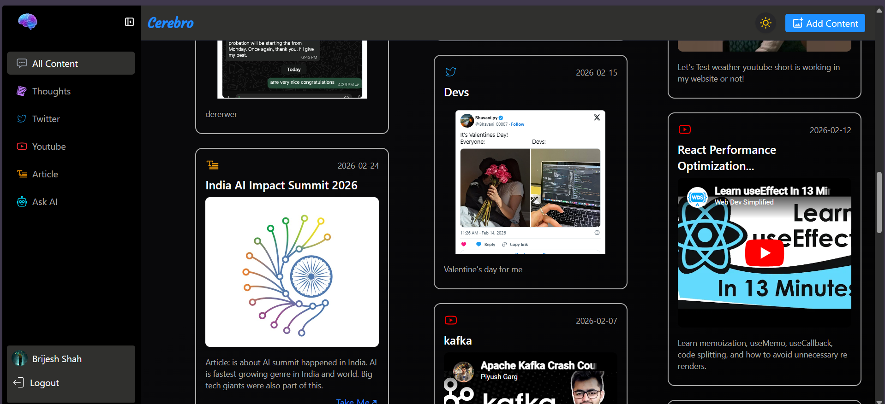

<div align="center">
  <br />
    
  <br />

  <h1>🧠 Cerebro (Second Brain)</h1>
  <p>
    <strong>An intelligent, AI-powered digital vault for your links, notes, and ideas.</strong>
  </p>
  
  <p>
    <a href="#-features">Features</a> •
    <a href="#%EF%B8%8F-tech-stack">Tech Stack</a> •
    <a href="#-getting-started">Getting Started</a> •
    <a href="#-roadmap">Roadmap</a>
  </p>
</div>

---

## 📖 Overview

**Cerebro** is a modern "Second Brain" application designed to help you capture, organize, and retrieve your digital knowledge effortlessly. Beyond just saving links and notes, Cerebro features an **AI-powered assistant** that uses Retrieval-Augmented Generation (RAG) to let you chat directly with your saved content.

Whether you're researching a topic, saving important articles, or simply building a personal knowledge base, Cerebro makes sure you never lose an idea again.

---

## ✨ Features

- **Link & Note Management:** Save URLs, text snippets, and personal notes. Cerebro automatically scrapes metadata (titles, descriptions, images) from your saved links.
- **AI Chat Assistant:** Talk to your Second Brain! Powered by Groq and Pinecone vector database, the AI can summarize, query, and synthesize answers based entirely on your saved knowledge.
- **Semantic Search:** Go beyond keyword matching. Find the exact content you need based on meaning and context using Xenova embeddings.
- **Tagging System:** Organize your content with custom, actionable tags.
- **Secure Authentication:** Seamless Google OAuth and secure email/password sign-in.
- **Responsive "Dark Luxury" UI:** A beautifully crafted, mobile-first interface using Tailwind CSS and Masonry grid layouts.

---

## 🛠️ Tech Stack

### Frontend
- **Framework:** React 18 (Vite) + TypeScript
- **Styling:** Tailwind CSS v4
- **State Management:** Recoil
- **Routing:** React Router v6
- **Forms & Validation:** React Hook Form
- **Authentication:** Google OAuth (`@react-oauth/google`)

### Backend
- **Server:** Node.js + Express + TypeScript
- **Database:** MongoDB (Mongoose)
- **Vector Database:** Pinecone (for semantic search & RAG)
- **AI / LLM:** Groq API + `@xenova/transformers`
- **Web Scraping:** Cheerio (for automatic link previews)
- **Media Storage:** Cloudinary + Multer
- **Security:** JWT + CORS

---

## 🚀 Getting Started

Follow these instructions to set up the project locally.

### Prerequisites

- Node.js (v18 or higher)
- MongoDB database
- API Keys for Groq, Pinecone, Cloudinary, and Google OAuth

### 1. Clone the repository

```bash
git clone https://github.com/yourusername/Cerebro.git
cd Cerebro
```

### 2. Setup the Backend

Navigate to the backend directory and install dependencies:

```bash
cd secondBrainBackend
npm install
```

Create a `.env` file in the `secondBrainBackend` directory and add the following variables:

```env
PORT=3000
MONGO_URI=your_mongodb_connection_string
JWT_SECRET=your_jwt_secret
GROQ_API_KEY=your_groq_api_key
PINECONE_API_KEY=your_pinecone_api_key
PINECONE_INDEX_NAME=your_index_name
CLOUDINARY_CLOUD_NAME=your_cloud_name
CLOUDINARY_API_KEY=your_cloudinary_api_key
CLOUDINARY_API_SECRET=your_cloudinary_secret
```

Start the backend development server:

```bash
npm run build
npm start
```

### 3. Setup the Frontend

Open a new terminal, navigate to the frontend directory, and install dependencies:

```bash
cd secondBrain
npm install
```

Create a `.env` file in the `secondBrain` directory and add your Google Client ID:

```env
VITE_GOOGLE_CLIENT_ID=your_google_oauth_client_id
VITE_API_URL=http://localhost:3000
```

Start the frontend development server:

:

```bash
npm run dev
```

Your app should now be running on `http://localhost:5173`!

---

## 🗺️ Roadmap

We are actively developing new features. Here is what's coming next:

- [ ] **Delete Content Functionality:** Safely remove items from MongoDB and vector space.
- [ ] **Share Brain:** Generate public links to share specific knowledge collections.
- [ ] **Advanced Search/Filter Bar:** Real-time filtering by tags, titles, and descriptions.
- [ ] **Edit Functionality:** Seamlessly update saved items and tags.
- [ ] **Clear AI Chat History:** Reset conversational context.
- [ ] **Pagination/Infinite Scroll:** Optimized loading for large knowledge bases.
- [ ] **User Profile Settings & Theme Toggle (Light/Dark Mode).**

---

<div align="center">
  <i>Built with ❤️ for lifelong learners.</i>
</div>
